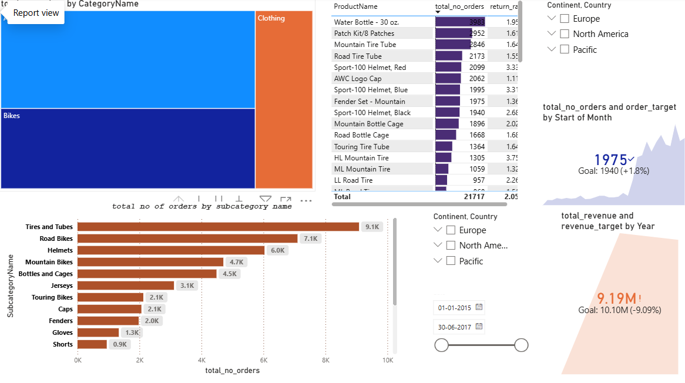
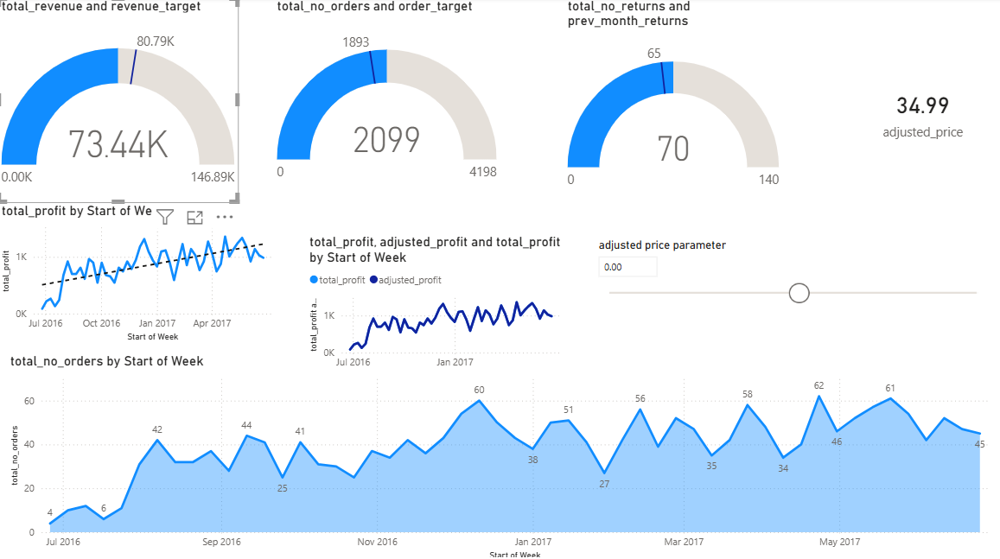
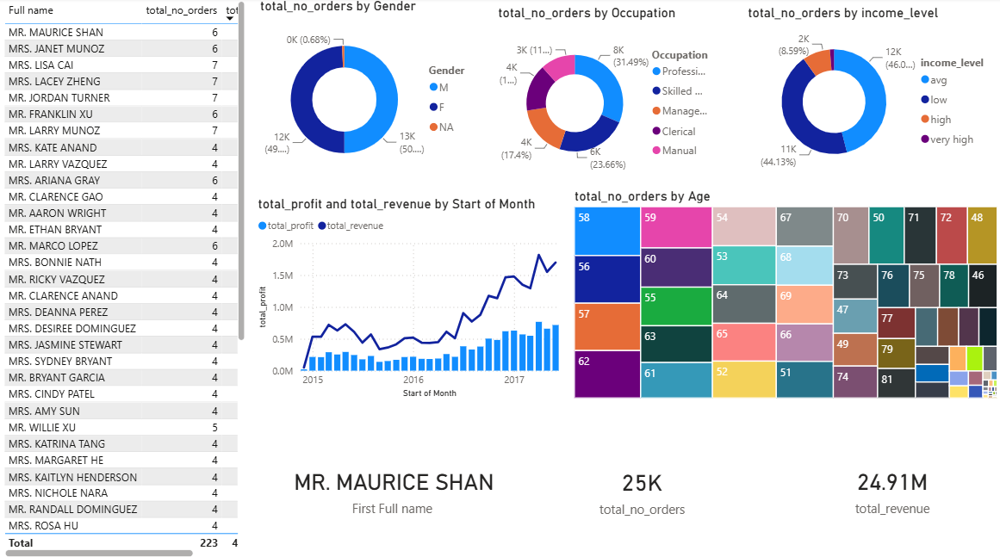

# Retail-sales-insights-dashboards-
# 📊 Retail Sales Insights Dashboard

**Retail Sales Insights Dashboard**

An interactive Power BI dashboard developed to analyze retail sales performance, customer behavior, product performance, revenue, profit, and order trends. The dashboard helps transform raw sales data into meaningful business insights for better decision-making.

---

 2. Short Description / Purpose

The Retail Sales Insights Dashboard is a comprehensive Power BI project designed to monitor and analyze key business metrics using interactive visualizations. It provides valuable insights into sales performance, customer demographics, product categories, revenue, profit, and order trends.

The project enables users to identify top-performing products, understand customer behavior, track business growth over time, and make data-driven business decisions through an intuitive and interactive dashboard.

---

 3. Tech Stack

The dashboard was built using the following tools and technologies:

- 📊 **Power BI Desktop** – Main data visualization platform used for building interactive dashboards.
- 🔄 **Power Query** – Used for data cleaning, transformation, and preparation.
- 🧮 **DAX (Data Analysis Expressions)** – Used for calculated measures, KPIs, and business logic.
- 🔗 **Data Modeling** – Built relationships among multiple tables for efficient analysis.
- 📁 **Microsoft Excel** – Source of the retail sales dataset.
- 📂 **File Format** – `.pbix` for development and `.png` for dashboard previews.

---

#4. Data Source

**Source:** Microsoft Excel Dataset

The dataset was imported from Excel into Power BI. Data cleaning, transformation, and modeling were performed using Power Query before creating interactive dashboards.

The dataset contains information related to:

- Sales
- Revenue
- Profit
- Orders
- Customers
- Products
- Categories
- Regions
- Occupation
- Income Level
- Date

---

 5. Features / Highlights

 Business Problem

Retail businesses generate a large volume of sales data every day. Without proper visualization and analysis, it becomes difficult to identify sales trends, customer preferences, and product performance.

 Goal of the Dashboard

- Analyze overall business performance.
- Track Revenue, Profit, and Orders.
- Monitor Product Performance.
- Understand Customer Demographics.
- Identify Sales Trends over time.
- Support data-driven business decisions.

 Dashboard Pages

 📈 Summary Report

- Revenue KPI
- Orders KPI
- Customer Details
- Revenue & Profit Trend
- Gender Distribution
- Occupation Analysis
- Income Level Analysis
- Age Analysis

### 📦 Product Report

- Product Category Analysis
- Sub-category Performance
- Product-wise
## 6. Business Impact & Insights

This dashboard helps businesses to:

- Monitor overall sales performance.
- Identify top-selling products.
- Track revenue and profit growth.
- Understand customer purchasing patterns.
- Compare product categories.
- Improve business decisions using interactive reports.

---

## 7. Dashboard Preview

### Summary Dashboard

### Product Dashboard

### Customer Dashboard

---

## 8. Author

**Harshit Bhatia**

Aspiring Data Analyst

**Skills**
- Power BI
- SQL
- Python
- Excel
- Data Analysis
- Data Visualization
- test
- [dashobard preview](https://github.com/Harshit2007-alt/Retail-sales-insights-dashboards-/blob/main/product%20report.png)
- 
